# Finnet Dashboard & Post Manager

A full-stack User Dashboard & Post Manager built as a technical assessment for Finnet Trust. Users can be browsed, their posts viewed in a live-updating feed, and new posts created all backed by a custom REST API.

> See [`ARCHITECTURE.md`](./ARCHITECTURE.md) for the full reasoning behind
> the technology choices, database design, and scaling strategy, and
> [`API_CONTRACT.md`](./API_CONTRACT.md) for the exact request/response
> shapes.

---

## Live Demo

- **Frontend:** https://finnet-blog-dashboard.vercel.app
- **Backend API:** https://finnet-blog-dashboard.onrender.com/api/users
- **Swagger UI:** https://finnet-blog-dashboard.onrender.com/swagger-ui.html

> Note: the backend is hosted on Render's free tier, which spins down after
> a period of inactivity. The first request after idle time may take
> 30–60 seconds to respond while the instance wakes up
> subsequent requests are fast.

---

## Project Structure

```
finnet-blog-dashboard/
  server/                      Spring Boot backend
    src/main/java/com/finnettrust/server/
      common/
        exception/             Custom exception hierarchy + global handler
        config/                CORS, OpenAPI/Swagger configuration
      user/                    Users module (entity, DTO, mapper, service, controller)
      post/                    Posts module (entity, DTO, mapper, service, controller)
      live/                    Live-update module (SSE broadcast)
    src/main/resources/
      application.yml
      db/migration/            Flyway migrations (schema + seed data)
    Dockerfile
  client/                      Angular frontend
    src/app/
      core/
        models/                TypeScript interfaces matching API_CONTRACT.md
        services/              HTTP + signal-based state per feature
        http/                  Retry interceptor
      features/
        users/                 User list, user detail card
        posts/                 Post feed, create-post form
      dashboard/               Top-level page composing everything together
    Dockerfile
    nginx.conf
  docker-compose.yml           Full local stack: postgres + server + client
  ARCHITECTURE.md              Design decisions, DB design, scaling strategy
  API_CONTRACT.md              Exact API request/response shapes
  PROGRESS.md                  Build order and phase-by-phase checklist
  README.md
```

_(Structure will be filled in as each part is built.)_

## Tech Stack

- **Backend:** Java, Spring Boot, PostgreSQL, Flyway
- **Boilerplate reduction:** Lombok (used selectively never `@Data` on JPA entities; see `ARCHITECTURE.md`)
- **Entity/DTO mapping:** MapStruct (compile-time generated)
- **API documentation:** springdoc-openapi, interactive Swagger UI at `/swagger-ui.html` once the backend is running locally or deployed
- **Frontend:** Angular (standalone components, signals)
- **Live updates:** Spring `ApplicationEventPublisher` + Server-Sent Events
- **Infra:** Docker, Docker Compose
- **Deployment:** Render (backend), Vercel (frontend)

## Prerequisites & Setup

- Docker + Docker Compose (recommended, no other local setup needed)
- **Or**, for running each side natively: Java 21, Maven (via included `./mvnw` wrapper), Node.js 22+, Angular CLI, PostgreSQL 18

## Setup Docker (recommended)

```bash
git clone https://github.com/joeljeremiahrupiah/finnet-blog-dashboard.git
cd finnet-blog-dashboard
docker compose up --build
```

Then visit:

- Frontend: http://localhost:4200
- Backend API: http://localhost:8080/api/users
- Swagger UI: http://localhost:8080/swagger-ui.html

Database schema and seed data (5 users, 3 posts each) are applied automatically on first startup via Flyway, no manual steps needed.

## Setup running locally without Docker

**Database:**

```bash
docker run --name finnet-postgres \
  -e POSTGRES_DB=finnet \
  -e POSTGRES_USER=postgres \
  -e POSTGRES_PASSWORD=postgres \
  -p 5432:5432 \
  -d postgres:18
```

(Or point `application.yaml`'s datasource env vars at any existing PostgreSQL 18 instance.)

**Backend:**

```bash
cd server
./mvnw spring-boot:run
```

**Frontend:**

```bash
cd client
ng serve
```

Visit http://localhost:4200.

## Seed Data

5 users and 3 posts per user are seeded automatically via Flyway migration (`server/src/main/resources/db/migration/V2__seed.sql`) on first application startup, no manual script needs to be run.

## Design Decisions & Trade-offs

Full write-up in [`ARCHITECTURE.md`](./ARCHITECTURE.md). In short:

- **Modular monolith** over microservices: right-sized for current scale, with module boundaries (`user`, `post`, `live`, `common`) drawn exactly where a future service split would occur.
- **`ApplicationEventPublisher`** over Kafka for live-update events: same decoupling benefit without broker overhead, with a named upgrade path (Kafka/Redis Pub/Sub) if the backend is ever horizontally scaled.
- **Flyway migrations** over `ddl-auto`: explicit, versioned, reviewable schema changes.
- **UUID primary keys** over auto-increment: avoids sequential ID leakage, safe for future distributed writes.
- **Custom exception hierarchy:** no bare `RuntimeException`/`IllegalArgumentException` thrown anywhere; every exception extends `ApplicationException` and is handled centrally by `GlobalExceptionHandler`. Error messages never include looked-up IDs.
- **MapStruct** for entity to DTO mapping: compile-time generated, no runtime reflection cost.
- **Server-Sent Events**, not WebSockets, for live updates: the app only needs one-directional server→client push, so SSE is simpler with no extra client-side library needed.

## Extra Features (beyond the core brief)

- **Live post updates:** creating a post is broadcast in real time to every connected client via SSE, without any refresh or polling.
- **Interactive API docs:** full Swagger UI for exploring and testing every endpoint directly in the browser.
- **Centralized, ID-free error handling:** consistent error shapes across every endpoint, with internal identifiers never exposed to the client.

## Known Limitations

- Render's free tier spins the backend down after inactivity.
- Live updates use `ApplicationEventPublisher`, which only works within a single backend instance, documented as a deliberate, scale-appropriate trade-off in `ARCHITECTURE.md`, with the upgrade path noted.

## Screenshots

### Dashboard Overview

Users, profile card, and posts feed together.
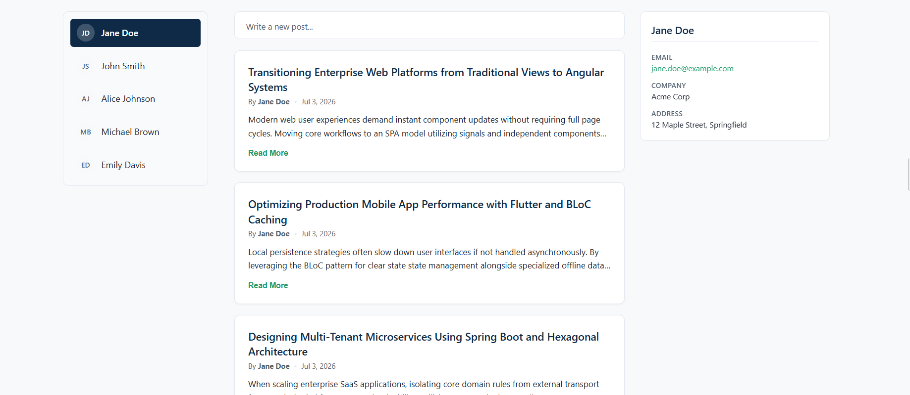

### User Selection & Loading States

Skeleton loaders shown while data is being fetched, and empty state messaging when a user has no posts yet.
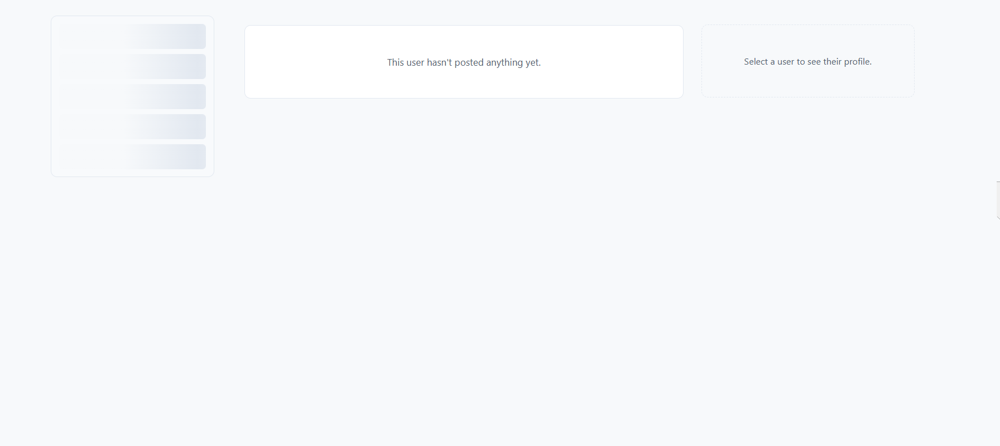
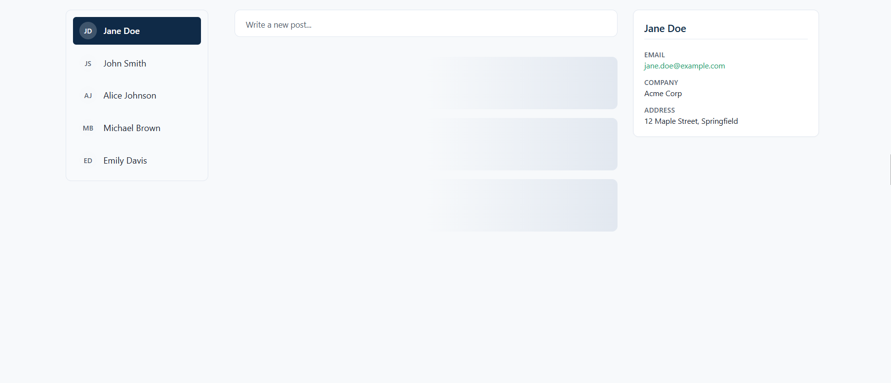

### Posts Feed — Read More / Show Less

Each post shows the author and date, truncated to two lines by default, expandable via **Read More** and collapsible via **Show Less**.
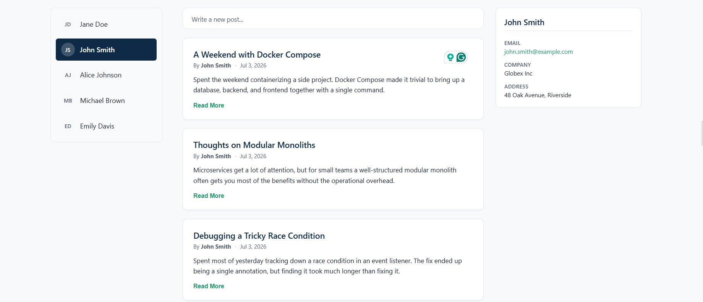
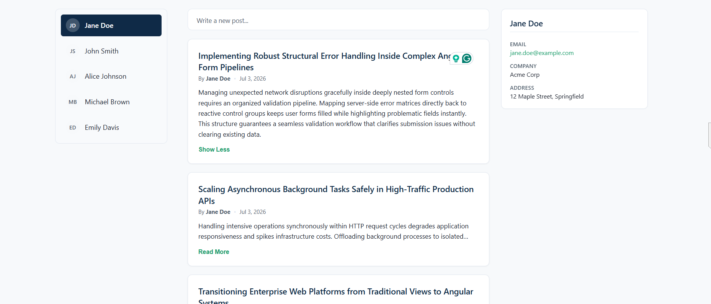

### Create Post — Empty State

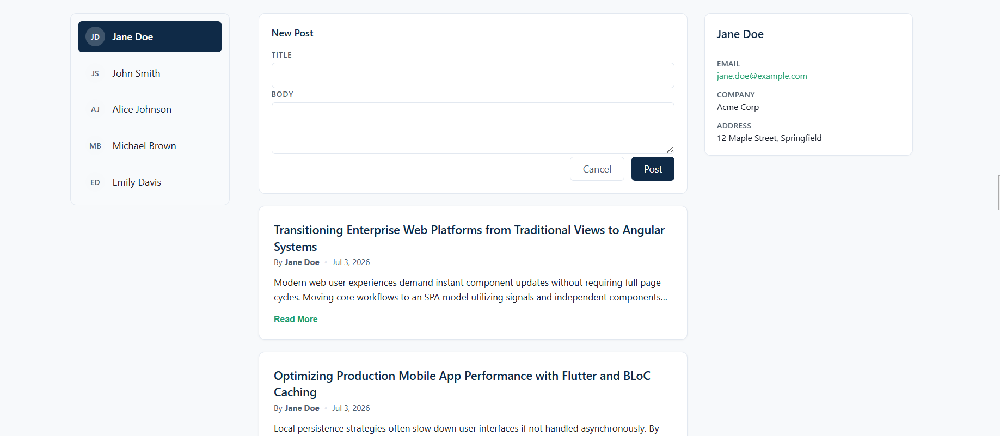

### Create Post — Validation

Inline validation on blur/submit, with red borders and a message per field.
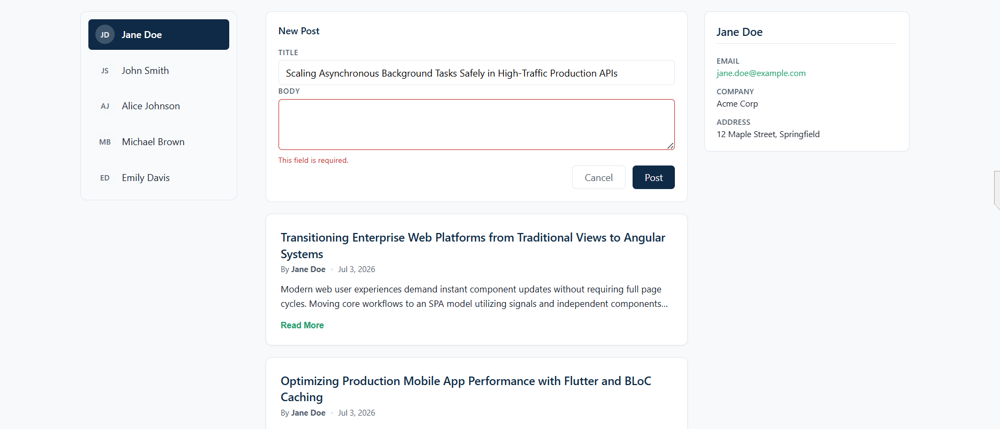
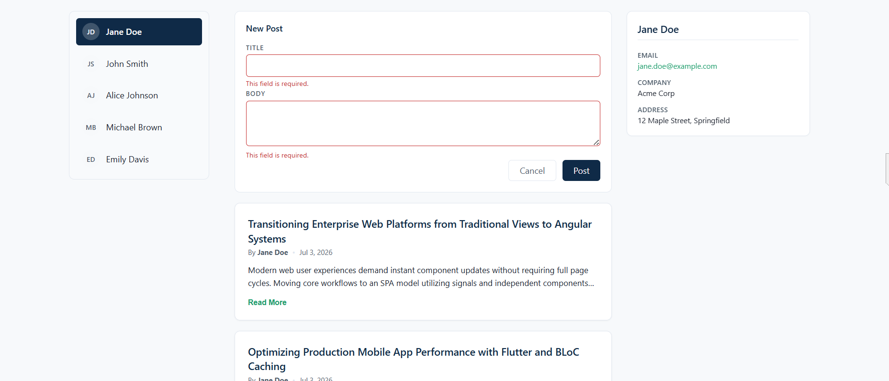

### Create Post — Filled and Submitting

Form filled out, then the submit button showing a loading spinner while the request is in flight.
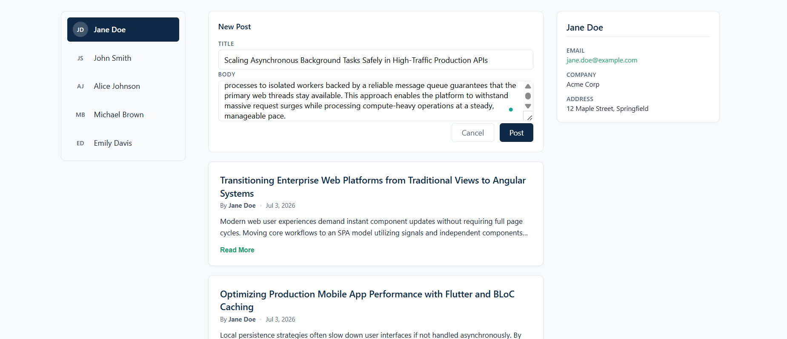
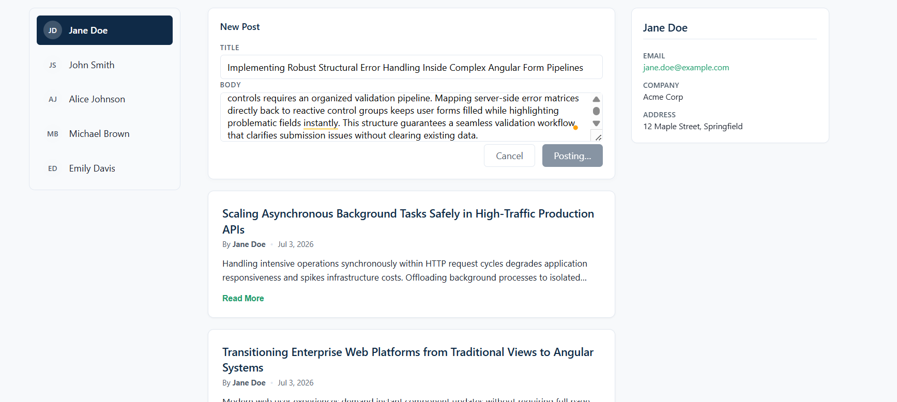

### Create Post — Server Error Handling

A user-friendly error banner is shown if the request fails (e.g. backend temporarily unreachable), with the form data preserved so nothing is lost.
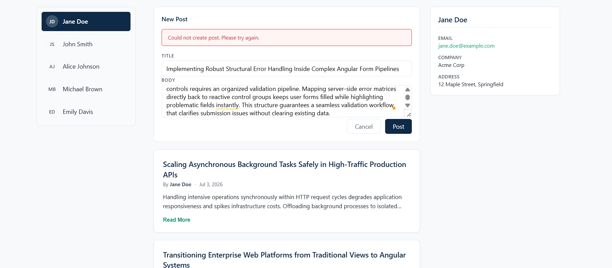

### Create Post — Success

On success, the new post appears instantly at the top of the feed delivered via the live-update (SSE) stream, without a page refresh.
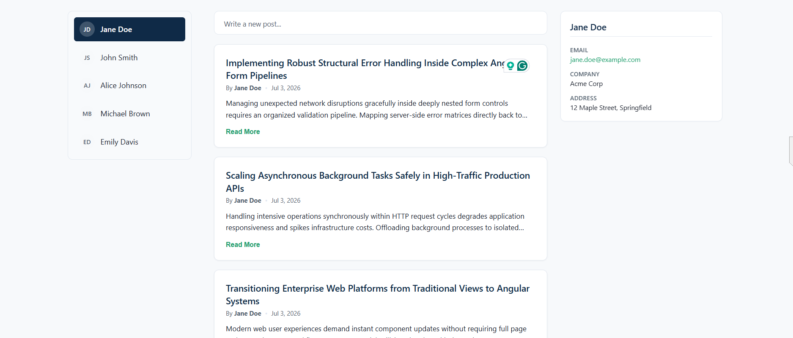
